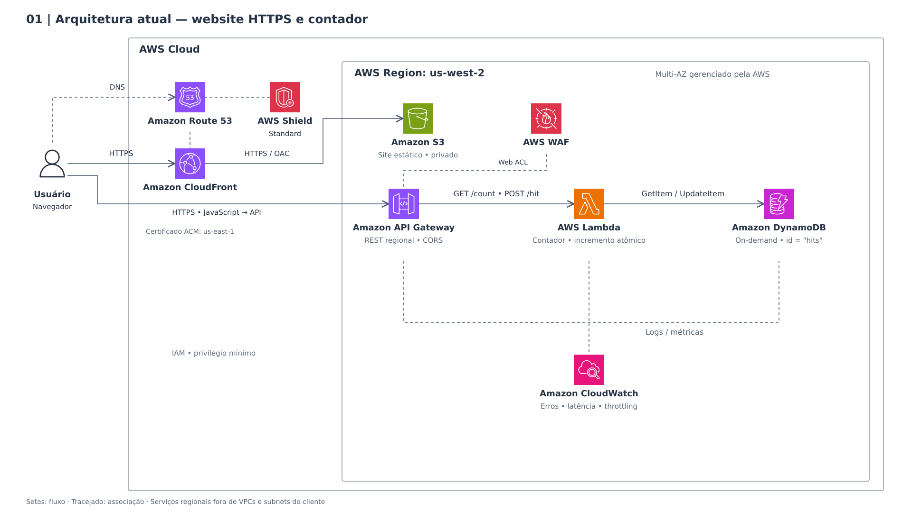
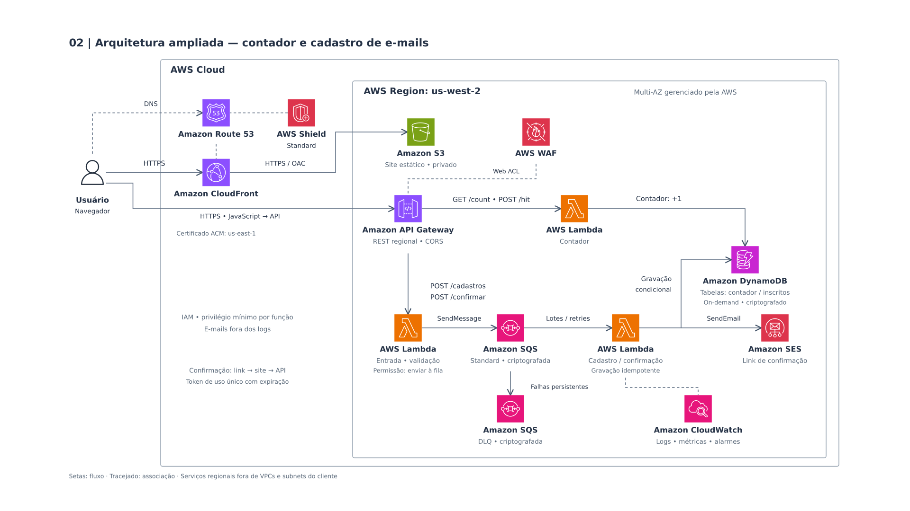

# hITCloud

Uma startup de marketing está lançando uma campanha para um novo produto. Eles criaram uma página de "Em Breve" e precisam de um contador simples que mostre quantas pessoas já se interessaram. Como eles não sabem se terão 10 ou 1 milhão de acessos, eles querem uma solução Serverless (sem servidor), que seja barata e escale automaticamente.

## Especificação:

Contador de Acessos: Uma startup de marketing está lançando uma campanha para um novo produto. Eles criaram uma página de "Em Breve" e precisam de um contador simples que mostre quantas pessoas já se interessaram. Como eles não sabem se terão 10 ou 1 milhão de acessos, eles querem uma solução Serverless (sem servidor), que seja barata e escale automaticamente.

### O que será construído:

- Amazon API Gateway: A porta de entrada que recebe o clique do usuário.
- AWS Lambda: O "cérebro" (uma função que só roda quando é chamada) que recebe o aviso do API Gateway e soma +1 no banco de dados.
- Amazon DynamoDB: Um banco de dados super rápido onde guardaremos o número total de acessos.

### Pontos de Atenção:

- Permissões (IAM): Verificar se as permissões entre os serviços estão corretas. O Lambda deve ter a permissão de ler e escrever (PutItem/UpdateItem) na tabela do DynamoDB. Por padrão, nada no AWS conversa com nada.
- Partição de Dados: No DynamoDB, você precisa de uma Partition Key. Para um contador simples, você pode usar uma chave fixa como "id" : "hits".
- CDK: Pode ser utilizada a versão do CDK em Python ou em TypeScript, o que for mais confortável de utilizar.

## Arquitetura Atual

## Arquitetura Ampliada

Após adicionar o cadastro de email para o cadastro promocional da campanha de marketing.

